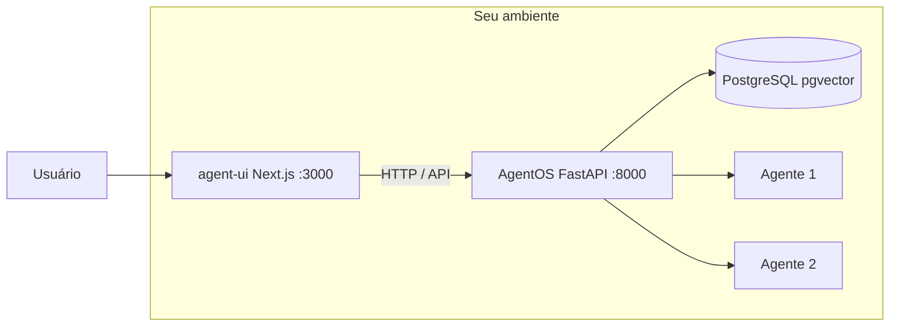

Quem quer rodar agentes de IA sem depender de UI ou infra gerenciada na nuvem tem uma opção direta: **Agno** no backend e **agent-ui** no front, tudo na sua rede. Neste post mostro como montar um microserviço de agentes self-hosted usando PostgreSQL com pgvector para RAG, o que ganha e o que perde com essa escolha. Um exemplo dessa stack em uso é o repositório [agent-orchestrator-mult-tenant](https://github.com/vinisdl/agent-orchestrator-mult-tenant), com AgentOS, agent-ui, Postgres (pgvector), RAG e suporte opcional a multi-tenant.

## O que é Agno e agent-ui

**Agno** é o framework (Python) que implementa o **AgentOS**: uma API FastAPI que expõe um ou vários agentes. Você registra os agentes em código, configura conexão com banco (por exemplo PostgreSQL) e sobe o serviço onde quiser (localhost, VM ou Docker). Nada disso exige a oferta cloud da Agno.

O **agent-ui** é o frontend em Next.js feito para falar com essa API. Você instala e roda na sua máquina ou servidor; ele se conecta à *sua* instância do AgentOS. Ou seja: UI e backend ficam sob seu controle.

Juntos, AgentOS e agent-ui são uma stack 100% self-hosted: conversar com agentes, persistir histórico e, com Postgres e pgvector, fazer RAG.

## Arquitetura: AgentOS + agent-ui + PostgreSQL (pgvector)

O desenho é simples: um app de backend (AgentOS), um app de frontend (agent-ui) e um banco. O usuário acessa a UI; a UI chama a API do AgentOS; o AgentOS usa o PostgreSQL para estado e, com a extensão pgvector, para vetores de RAG.

- **AgentOS**: sobe em geral na porta 8000 (`fastapi dev` ou uvicorn). Código em `agent-os/` com `pyproject.toml` (agno[os], anthropic/mcp etc.), módulo `db/` com `get_postgres_db()` e variáveis `DB_*` no `.env`. O script de entrada instancia `AgentOS(agents=[...], db=get_postgres_db())` e expõe `app = agent_os.get_app()`.
- **agent-ui**: sobe na porta 3000. Você aponta para o AgentOS via `NEXT_PUBLIC_AGENTOS_URL` (ex.: `http://localhost:8000`) ou pela sidebar. Em Docker, em produção você usa a URL pública do AgentOS.
- **PostgreSQL com pgvector**: no Docker Compose, um serviço (ex.: `agentos-db`) com imagem que inclua pgvector. O AgentOS conecta com `DB_HOST`, `DB_PORT`, `DB_USER`, `DB_PASS`, `DB_DATABASE`. Os agentes usam o mesmo banco para sessões e, se você configurar, para embeddings e busca vetorial (RAG).

A comunicação e delegação entre agentes (um chamar o outro, workflows, teams) ficam no código Python do AgentOS. No agent-ui você só escolhe com qual agente conversar e vê as respostas e tool calls.

## RAG com Postgres e pgvector

PostgreSQL com a extensão **pgvector** permite guardar embeddings e fazer busca por similaridade. No contexto do AgentOS você pode:

- Persistir embeddings de documentos ou chunks em tabelas com coluna do tipo `vector`.
- Nos agentes, usar ferramentas ou lógica que consultem esse banco (por exemplo busca por similaridade) e injetem o contexto retornado no prompt.

Assim você tem RAG sem precisar de um serviço externo de vetores: um único Postgres faz papel de banco relacional e de vetorial. Para POC e para muitos casos de uso internos isso basta.

## Vantagens

- **Controle total**: backend e UI na sua infra; dados e tráfego não passam por serviço gerenciado da Agno.
- **Stack conhecida**: FastAPI, Next.js, PostgreSQL. Fácil de integrar com o resto do seu ecossistema (auth, logs, métricas).
- **Um banco para estado e RAG**: Postgres com pgvector reduz o número de componentes. Menos serviços para operar.
- **Multi-agentes na mesma instância**: o agent-ui já lista e permite escolher agente; a orquestração (teams, workflows) você modela no Python.
- **Docker e perfis DEV/PROD**: com compose base + overrides (`docker-compose.dev.yml` e `docker-compose.prod.yml`) você tem hot-reload em desenvolvimento e build enxuto em produção.

## Desvantagens

- **Você opera tudo**: backups, atualizações, segurança e escalabilidade do Postgres e dos containers são por sua conta.
- **Escala do vetorial**: pgvector funciona bem até um certo volume; para índices enormes ou latência muito baixa, um engine dedicado (ex.: Qdrant, Weaviate) pode ser melhor.
- **Lógica multi-agente em código**: delegação e workflows estão no Python, não numa UI de orquestração; mudanças exigem deploy.
- **Porta e CORS**: é preciso alinhar a porta do AgentOS (8000 ou 7777) com o que o agent-ui espera e configurar CORS no AgentOS para a origem da UI.

## Como rodar (resumo)

1. **Backend**: em `agent-os/`, venv com `agno[os]`, script que sobe o AgentOS com pelo menos um agente e `db=get_postgres_db()`, rodar com `fastapi dev` na porta desejada.
2. **Frontend**: em `agent-ui/`, `npx create-agent-ui@latest` ou clone do repositório, `pnpm install`, `pnpm dev`, e configurar o endpoint do AgentOS.
3. **Docker**: Dockerfiles para agent-os e agent-ui; compose base com agent-os, agent-ui e PostgreSQL (pgvector); overrides DEV (volumes, hot-reload) e PROD (build otimizado). Variáveis em `.env` (copiar de `.env.example`).

**DEV:** `docker compose -f docker-compose.yml -f docker-compose.dev.yml up --build`  
**PROD:** `docker compose -f docker-compose.yml -f docker-compose.prod.yml up -d --build`

O agent-ui não substitui o trabalho de definir e evoluir os agentes no código. Ele é a interface self-hosted para conversar com eles. Se a ideia é uma POC de agentes com RAG na sua máquina ou no seu servidor, você pode clonar o [agent-orchestrator-mult-tenant](https://github.com/vinisdl/agent-orchestrator-mult-tenant) e seguir o README para subir tudo com Docker. Agno + agent-ui + Postgres com pgvector é um caminho direto; a ressalva é que operação e escala do vetorial ficam com você.
